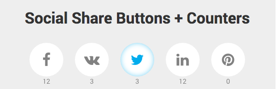

# jQuery Social Share Buttons

jQuery plugin for Social Share Buttons with counters. 

Supported for:
- Facebook, 
- VK, 
- Twitter, 
- LinkedIn, 
- Pinterest.

## Live demo
jQuery Plugin version [Codepen Demo](http://codepen.io/Belyash/full/qdzVgx/)

## Easy to use
HTML markup:
<pre>
&lt;span class="fa fa-facebook" data-social="fb" data-count="..."&gt;Facebook&lt;/span&gt;
&lt;span class="fa fa-vk" data-social="vk" data-count="..."&gt;Facebook&lt;/span&gt;
&lt;span class="fa fa-twitter" data-social="tw" data-count="..."&gt;Facebook&lt;/span&gt;
&lt;span class="fa fa-linkedin" data-social="ln" data-count="..."&gt;Facebook&lt;/span&gt;
&lt;span class="fa fa-pinterest" data-social="pt" data-count="..."&gt;Facebook&lt;/span&gt;
</pre>
JavaScript Code:
<pre>
$('[data-social]').socialShares();
</pre>

## Settings
By default buttons share current <code>location.href</code>, but you can customize sharing URL just put the hash with <code>url</code>:
<pre>
$('[data-social]').socialShares({
    url: 'http://belyash.github.io' // Default is current location.href
});
</pre>