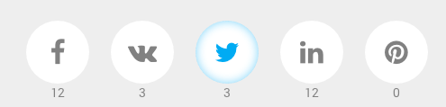

# Social Share Buttons

Social Share Buttons with Counters: Facebook, VK, Twitter, LinkedIn, Pinterest.

## Demo
[Codepen Demo](http://codepen.io/Belyash/full/ogQbWj/)

## How to use
HTML markup:
<pre>
&lt;span class="fa fa-facebook" data-social="fb" data-count="..."&gt;Facebook&lt;/span&gt;
</pre>
JavaScript Code:
<pre>
$('[data-social]').socialShares({
    url: 'http://belyash.github.io'
});
</pre>